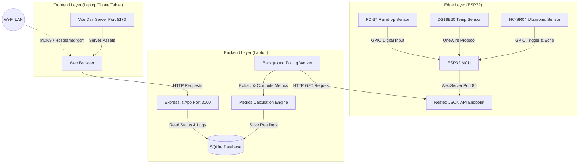

# 💧 Smart Water Tank Monitoring & Rain Detection System
## Technical System Architecture & Implementation Documentation

This document provides an in-depth technical overview of the **Smart Water Tank Monitoring and Rain Detection System**. It details the hardware design, microcontroller firmware, backend API design, frontend presentation layer, and local area network configuration used to share the system dynamically.

---

## 🏛️ 1. System Architecture Overview

The system utilizes a modern, distributed IoT architecture split into three layers: the **Hardware/Edge Layer**, the **Backend/Database Layer**, and the **Frontend/Presentation Layer**.



---

## 🔌 2. Hardware Layer: Sensor Integration & Wiring

The core edge device is the **ESP32 NodeMCU**, an ultra-low-cost, low-power system-on-a-chip (SoC) microcontroller with integrated Wi-Fi and dual-mode Bluetooth. It runs on a Tensilica Xtensa dual-core 32-bit LX6 microprocessor.

### A. HC-SR04 Ultrasonic Distance Sensor
* **Concept:** Utilizes sonar to measure the distance to the water surface. 
* **Operation:** The ESP32 sends a 10-microsecond high pulse to the **Trigger** pin, causing the transmitter to emit an 8-cycle burst of ultrasound at 40 kHz. The receiver listens for the bounce-back signal. The **Echo** pin goes high from the moment the signal is sent until it is received. 
* **Formula:** The distance is calculated based on the speed of sound ($v \approx 343\text{ m/s}$ at 20°C):
  $$\text{Distance (cm)} = \frac{\text{Time Duration (}\mu\text{s)} \times 0.0343}{2}$$
* **Wiring:** Trigger connects to GPIO 23, Echo to GPIO 22.

### B. DS18B20 Temperature Sensor
* **Concept:** A digital thermometer sensor providing 9-to-12 bit Celsius temperature measurements.
* **Operation:** Uses the proprietary **1-Wire bus** protocol developed by Dallas Semiconductor. This protocol allows multiple devices to share a single data line, communicating via unique 64-bit ROM registration codes. 
* **Wiring:** Data pin connects to GPIO 4. A $4.7\text{k}\Omega$ pull-up resistor must be placed between the Data and VCC pins to pull the bus line high when idle.

### C. FC-37 (or YL-83) Raindrop Detection Sensor
* **Concept:** Detects precipitation using a nickel-coated resistive rain board and an LM393 voltage comparator module.
* **Operation:** Dry conditions create high resistance across the sensing grid, causing the digital output (**DO**) to remain `HIGH`. Water drops bridge the traces, lowering resistance and pulling DO `LOW`. The onboard potentiometer calibrates the comparator's reference threshold.
* **Wiring:** DO connects to GPIO 18. **VCC must connect to 3.3V (3V3)** to protect the ESP32’s input buffers, as the ESP32's GPIO pins are not 5V-tolerant.

### 📋 Wiring Schematic Map
| Sensor Module | Sensor Pin | ESP32 Pin | Signal Type / Mode |
| :--- | :--- | :--- | :--- |
| **HC-SR04** | VCC | 5V / VIN | Power Input (5V) |
| **HC-SR04** | Trig | GPIO 23 | Digital Output |
| **HC-SR04** | Echo | GPIO 22 | Digital Input |
| **HC-SR04** | GND | GND | Ground |
| **DS18B20** | VCC | 3.3V (3V3) | Power Input (3.3V) |
| **DS18B20** | Data | GPIO 4 | Digital Input/Output (1-Wire) |
| **DS18B20** | GND | GND | Ground |
| **FC-37 Rain** | VCC | 3.3V (3V3) | Power Input (3.3V) |
| **FC-37 Rain** | GND | GND | Ground |
| **FC-37 Rain** | DO | GPIO 18 | Digital Input (Active LOW) |

---

## 💻 3. Firmware Layer (ESP32 C++ Sketch)

The ESP32 runs an Arduino C++ environment. It establishes a Wi-Fi connection and initializes a local web server utilizing the `WebServer.h` library on **Port 80**.

### Key Architectural Concepts in Firmware:
1. **TCP/IP Web Server:** Binds a socket listener to port 80. When an incoming HTTP request is received, it executes `handleRoot()`.
2. **JSON Payload Serialization:** Avoids importing heavyweight JSON serialization libraries by directly building a formatted string payload in RAM.
3. **Structured Domain Schema:** Groups raw metrics inside a nested `"sensors"` JSON object. This groups related device payloads into an OpenAPI-compliant structure:

```json
{
  "device": "ESP32",
  "status": "ok",
  "sensors": {
    "ultrasonic": {
      "distance_cm": 30.5,
      "status": "ok"
    },
    "temperature": {
      "temperature_c": 28.5,
      "status": "ok"
    },
    "rain": {
      "is_raining": false,
      "status": "ok"
    }
  }
}
```

---

## ⚙️ 4. Backend Layer (Node.js & Express)

The backend represents the system coordinator. It is written in **Node.js** using the **Express.js** framework.

### A. Polling Worker (Data Ingestion)
The backend runs a background event loop using Node's `setInterval()` function (every 5 seconds).
* **Network Call:** Initiates an asynchronous HTTP `GET` request using the `fetch()` API to retrieve the ESP32 payload.
* **Timeout & Failover:** Employs an `AbortController` to set a 4-second timeout limit. If the ESP32 is offline, it safely flags a connection failure without hanging the backend server thread.

### B. Database Layer (SQLite)
Uses **SQLite** (via the `sqlite3` driver) for data persistence.
* **Server Initialization Schema Verification:** During start-up, [dbService.js](file:///D:/Projects/ESP32_project/Smart-Water-Tank-Monitoring-and-Leak-Detection-System/backend/services/dbService.js) checks table schemas using `CREATE TABLE IF NOT EXISTS`.
* **Dynamic Table Modification:** Dynamically runs an `ALTER TABLE` query inside a try-catch block to inspect and automatically add the `is_raining` column to the `readings` table without losing historical telemetry data if you migrate from an older database version.
* **Database Mapping:** Map snake_case database schema values (`is_raining`, `water_depth_cm`) to camelCase structures required by the frontend API definitions (`isRaining`, `waterLevel`).

### C. REST API Routes
Exposes JSON endpoints under the `/api/tank/` namespace:
* `GET /api/tank/latest`: Returns the most recent processed sensor metrics formatted for dashboard cards.
* `GET /api/tank/history?limit=N`: Returns chronological readings for chart rendering.

---

## 🎨 5. Frontend Layer (React, Vite, & TypeScript)

The user interface is built as a **Single Page Application (SPA)** using **React 18** and **Vite** as the bundler.

### Key Architectural Concepts in Frontend:
1. **Type Safety (TypeScript):** Fully enforces types via interfaces like `LatestReading` and `HistoryReading` in [sensor.ts](file:///D:/Projects/ESP32_project/Smart-Water-Tank-Monitoring-and-Leak-Detection-System/frontend/src/types/sensor.ts), minimizing runtime data access bugs.
2. **State Management & Data Polling:** A custom data fetching hook poll-queries `GET /latest` from the backend API, maintaining active data updates in React's component state.
3. **SVG Fluid Level Animation:** Uses a dynamic `<svg>` vector drawing displaying wave-like movements whose height parameters are mapped directly to `LatestReading.tankPercentage`.
4. **Responsive Layouts:** Utilizes Tailwind CSS grid utilities to adjust layouts smoothly across smartphones, tablets, and desktop displays.

---

## 🌐 6. Local Networking, Addressing, & Device Sharing

Sharing the dashboard on a Local Area Network (LAN) requires resolving three primary networking issues: IP instability, addressing URLs, and browser cross-origin protections.

```
[Smartphone (LAN Client)] 
      │
      ├─► Resolves hostname "gdr" to 192.168.8.100 via mDNS
      │
      └─► Requests http://gdr:5173
             │
             ▼
      [Vite Server (0.0.0.0:5173)]
             │
             ├─► Verifies Host Header matches "gdr" (Vite 6 AllowedHosts)
             │
             └─► Serves index.html -> Requests API http://gdr:3000/api/tank/latest
```

### A. IP Instability: DHCP Address Reservation
By default, the router's **DHCP (Dynamic Host Configuration Protocol)** server dynamically leases IP addresses to devices. If the laptop or ESP32 restart, the router might give them new IPs, breaking the backend configuration.
* **Solution:** We configure **DHCP Reservation (Static Lease)** inside the Wi-Fi router's admin panel. The router checks the unique hardware **MAC (Media Access Control) address** of the ESP32 and the laptop and permanently binds them to static IP addresses (e.g., ESP32 to `192.168.8.172`, Laptop to `192.168.8.100`).

### B. Network Interfaces & Binding (`0.0.0.0`)
A computer typically has multiple network cards (interfaces)—such as the loopback interface (`localhost` / `127.0.0.1`) and the Wi-Fi adapter card (e.g., `192.168.8.100`).
* **Vite Network Binding:** By setting `server.host = true` inside [vite.config.ts](file:///D:/Projects/ESP32_project/Smart-Water-Tank-Monitoring-and-Leak-Detection-System/frontend/vite.config.ts), Vite is configured to bind to `0.0.0.0` (all interfaces) rather than locking to the local loopback `127.0.0.1`. This instructs the operating system to accept incoming requests from other devices on the Wi-Fi network.

### C. Name Resolution: mDNS & Hostname Broadcasts
Typing IP addresses in the browser is inconvenient. Operating systems use local name resolution mechanisms:
* **Multicast DNS (mDNS) / NetBIOS:** The operating system of your Windows Laptop (hostname `"gdr"`) automatically multicasts its name to the local Wi-Fi subnet.
* **DNS Resolution:** Any mobile phone or tablet on the same Wi-Fi network can look up `http://gdr:5173` or `http://gdr.local:5173`. The device translates `"gdr"` directly into your laptop's current local IP without requiring external internet servers.

### D. Host Header Validation (Vite 6 Security)
Vite 6 includes built-in protection against **DNS Rebinding Attacks** (a security vulnerability where malicious websites exploit local DNS setups). Vite blocks any network request whose HTTP `Host` header does not match the loopback address or a raw IP address.
* **Solution:** To allow access via the laptop's text name, we updated `vite.config.ts` to add `"gdr"` to the `server.allowedHosts` array:
  ```typescript
  server: {
    host: true,
    port: 5173,
    allowedHosts: ["gdr"]
  }
  ```
  This allows devices on the Wi-Fi network to successfully handshake and load the dashboard.
